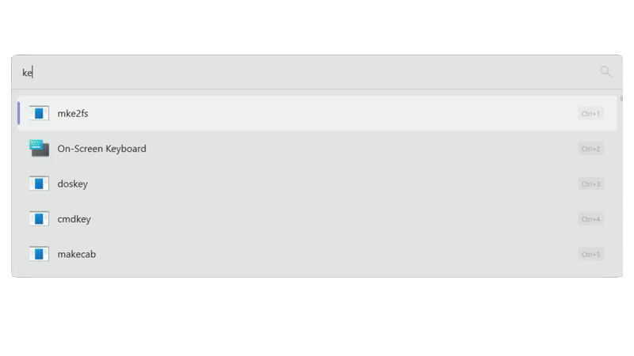
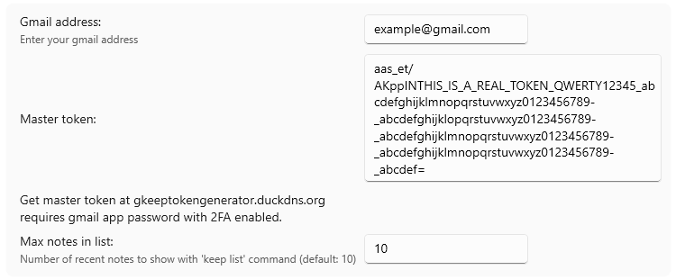

## GoogleKeepFlow
Add and browse notes in Google Keep

## Features:
- Create notes with `keep [note text]`
- Type `keep list` to see latest notes

## Please note:
1. Requires gmail address with [2FA enabled](https://myaccount.google.com/signinoptions/twosv)
2. [App password](https://myaccount.google.com/apppasswords)
3. Get master token at [gkeeptokengenerator.duckdns.org](https://gkeeptokengenerator.duckdns.org/) or [host locally](token-server/README.md) by yourself
4. Paste your master token & enter your Gmail in plugin settings

## Installation:
type `pm install GoogleKeepFlow by keekys`in FlowLauncher

or

Unzip [archive](https://github.com/keekyslusus/GoogleKeepFlow/releases/latest) to `%appdata%\FlowLauncher\Plugins`