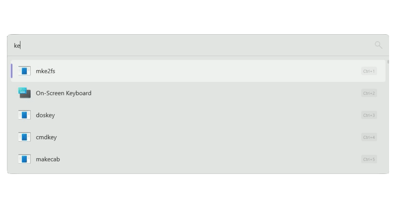
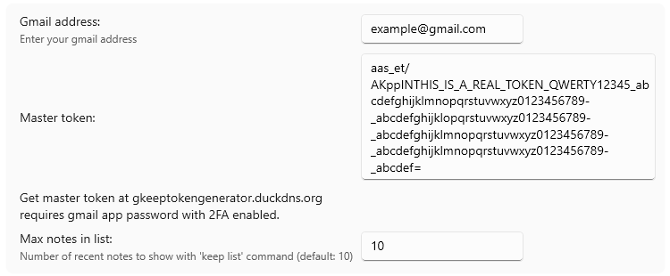
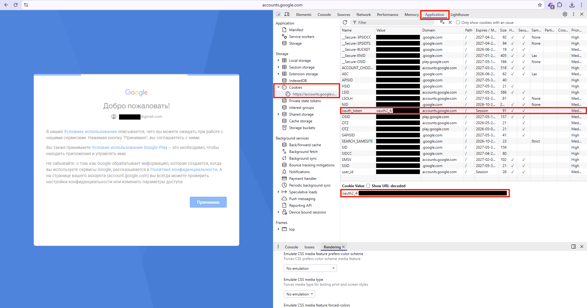
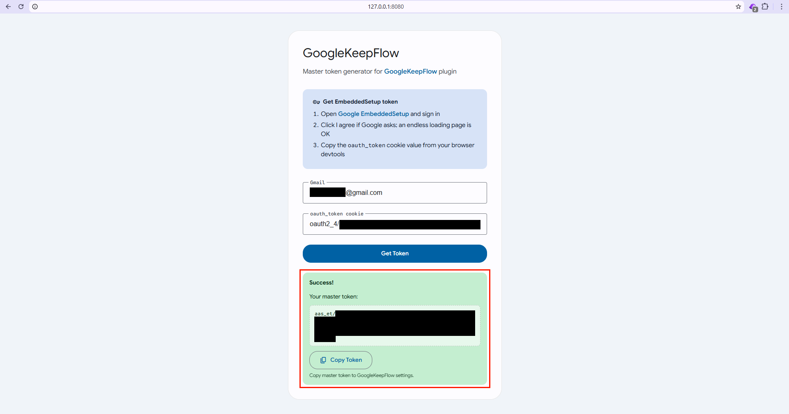

## GoogleKeepFlow
Add and browse notes in Google Keep

## Usage
- Create notes with `keep [note text]`
- Type `keep list` to see latest notes

## Please note
1. Get master token at [gkeeptokengenerator.duckdns.org](https://gkeeptokengenerator.duckdns.org/) or [host locally](token-server/) by yourself
2. Paste your master token & enter your Gmail in plugin settings

## Generate master token
1. Open [Google EmbeddedSetup](https://accounts.google.com/EmbeddedSetup) and sign in.
2. Click **I agree** if prompted; an endless loading page is fine.
3. Copy the `oauth_token` cookie value from browser devtools.
4. Paste it into the [token generator](https://gkeeptokengenerator.duckdns.org/) and click **Get Token**.
5. Paste the returned `aas_et/...` master token and your Gmail into plugin settings.

In Chrome, open DevTools, go to **Application** -> **Cookies** -> `https://accounts.google.com`, then copy the `oauth_token` value. In Firefox, use **Storage** -> **Cookies** -> `https://accounts.google.com`.

## Installation
type `pm install GoogleKeepFlow by keekys`in FlowLauncher

or

Unzip [archive](https://github.com/keekyslusus/GoogleKeepFlow/releases/latest) to `%appdata%\FlowLauncher\Plugins`