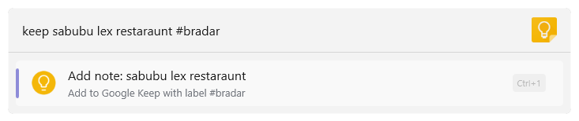
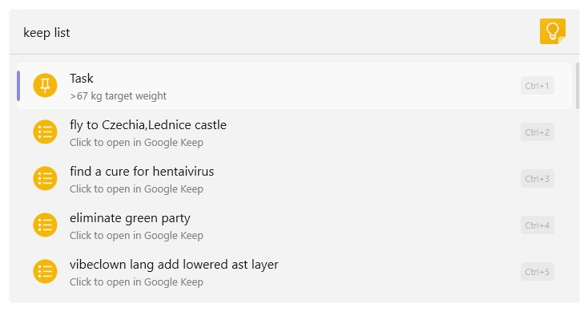
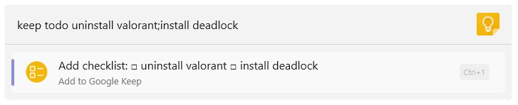
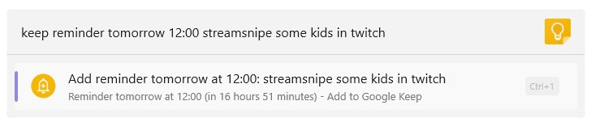
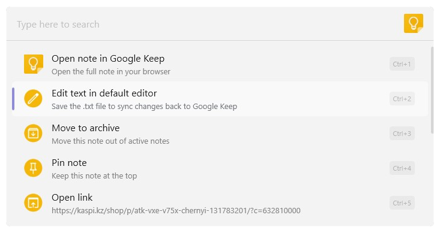

  <picture>
    <source media="(prefers-color-scheme: dark)" srcset=".github/readme_for_dark_theme.svg">
    <source media="(prefers-color-scheme: light)" srcset=".github/readme_for_light_theme.svg">
    
  </picture>

  
  
  
  

## GoogleKeepFlow: Google Keep plugin for [Flow Launcher](https://www.flowlauncher.com/)

### Add, browse, edit, and organize Google Keep notes

### Commands

`keep ?`
`keep pin`
`keep add`
`keep list`
`keep edit`
`keep todo`
`keep setup`
`keep archive`
`keep reminder`

## Features

### Quick note capture

- Type after `keep` to create a new Google Keep note
- Use `keep add [text]` for explicit note creation
- Add labels with hashtags like `#work` or `#ideas`

### Notes browser

- `keep list` to show recent active notes
- Search notes by title, body text, and labels
- Shows pinned notes first and keeps recently updated notes near the top
- Opens the selected note directly in Google Keep

### External editing

- `keep edit [search]` to search notes and open the selected note in your text editor
- Save the `.txt` file to sync changes back to Google Keep

### Checklists

- `keep todo [item 1; item 2]` to create a Google Keep checklist
- Separate checklist items with semicolons

### Archive

- `keep archive` to browse archived notes
- Search archived notes the same way as active notes
- Type text after `keep archive` to create an archived note
- Restore archived notes from the context menu

### Pinned notes

- `keep pin [text]` to create a pinned note
- Pin or unpin existing notes from the context menu

### Reminders

> Reminders are experimental and must be enabled in plugin settings.

- `keep remind in 10m [text]` to create a note with a reminder
- Supports relative times like `in 10m`, `in 2h`, and `in 1d`
- Supports absolute times like `today 09:00`, `tomorrow 9am`, and `01.05.2026 21:00`

### Adaptive context menu

- Open Google Keep, reminders, archive, or trash from the launcher result
- Open the selected note in Google Keep
- Edit plain text notes in your text editor and sync changes back after saving
- Move notes to archive or restore them from archive
- Pin or unpin notes
- Open links found inside note text
- Move notes to trash

## Setup

1. Run `keep setup`.
2. Sign in with your Google account inside the WebView2 window.
3. `keep ?` to see available commands.

## Installation

type `pm install GoogleKeepFlow by keekys` in Flow Launcher

or

Unzip [archive](https://github.com/keekyslusus/GoogleKeepFlow/releases/latest) to `%appdata%\FlowLauncher\Plugins`
